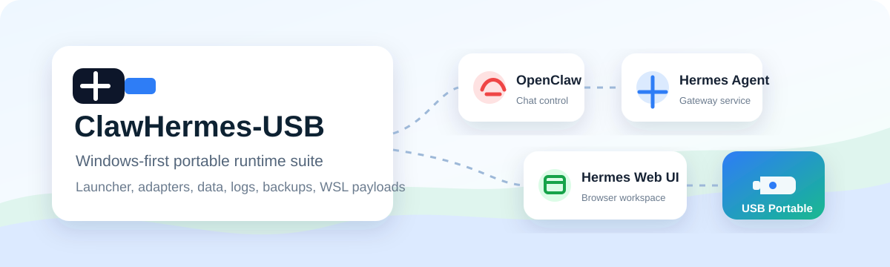
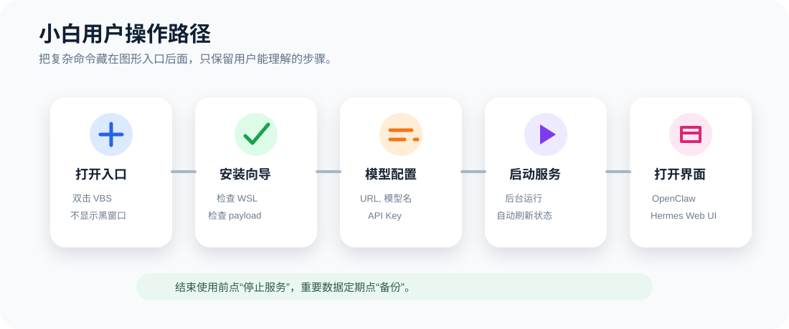

# ClawHermes-USB

ClawHermes-USB 是一个 Windows 优先的便携运行套件，用来从同一个项目目录运行 [OpenClaw](https://github.com/openclaw/openclaw)、[Hermes Agent](https://github.com/NousResearch/hermes-agent) 和 [EKKOLearnAI/hermes-web-ui](https://github.com/EKKOLearnAI/hermes-web-ui)。项目目标不是 fork 上游应用，而是在它们外面提供一层可交付、可启动、可备份、可诊断的便携编排层。



开发标注：本项目开发过程中使用了 [Superpowers](https://github.com/obra/superpowers)、OpenAI ChatGPT 5.5 模型和 OpenAI Codex 辅助完成。

## 推荐入口

普通用户优先双击：

```text
launcher/windows/ClawHermes-Control.vbs
```

这个入口会打开图形控制中心，不显示黑色命令窗口。图形界面左侧包含安装向导、启动服务、停止服务、打开界面、模型配置、日志、备份、修复 / 更新和主题切换。



如果 VBS 被安全软件拦截，可以改用兼容入口：

```text
launcher/windows/ClawHermes-Control.bat
```

## 本地开发

开发者 clone 仓库后，先安装依赖并构建核心：

```powershell
npm install
npm run build
```

然后运行 GUI：

```powershell
launcher/windows/ClawHermes-Control.vbs
```

更完整的本地运行说明见：

- [开发者本地运行指南](docs/developer-local-runbook.zh-CN.md)

## U 盘交付

不要让普通用户在 U 盘上执行 `npm install`、`pnpm install` 或 Python 依赖安装。交付前应在开发机或构建机上准备好：

- `apps/openclaw`
- `apps/hermes-agent`
- `apps/hermes-web-ui`
- `runtimes/`
- WSL rootfs 或 WSL 备份 payload
- `core/node/dist`

U 盘速度会影响启动和运行体验，尤其是 WSL 文件系统、`node_modules`、SQLite 数据、日志和缓存。建议使用 USB 3.x 高速 U 盘或移动 SSD，并尽量交付预构建产物，不在 U 盘上做依赖安装。

完整交付说明见：

- [U 盘部署与交付指南](docs/usb-deployment.zh-CN.md)
- [U 盘交付包生成 Runbook](docs/usb-release-build-runbook.zh-CN.md)

## 关键目录

```text
launcher/   面向用户的 Windows 启动脚本和 GUI 入口
core/       ClawHermes 自己的 Node/TypeScript 编排核心
adapters/   服务适配器描述，定义 OpenClaw、Hermes 等如何启动和检查
apps/       上游应用 payload，交付版建议放预构建产物而不是源码工作树
runtimes/   便携 Node、Python、Git、WSL rootfs 等运行时 payload
data/       用户配置、日志、缓存、会话、备份和 WSL 导入数据
docs/       产品、架构、开发和交付文档
```

## 常用命令

```powershell
node core/node/dist/clawhermes.js setup --json
node core/node/dist/clawhermes.js status --json
node core/node/dist/clawhermes.js start --json
node core/node/dist/clawhermes.js stop --json
node core/node/dist/clawhermes.js backup --json
```

## 验证

```powershell
npm test
```

中文文档必须保持 UTF-8 可读，不能提交乱码。
