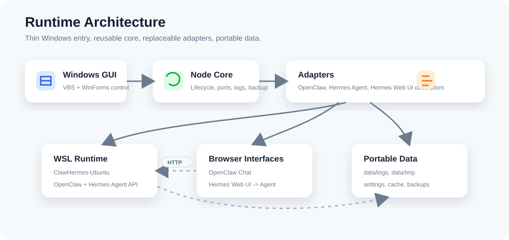

# 架构设计：ClawHermes-USB

## 1. 设计意图

ClawHermes-USB 是围绕上游 agent 工具构建的一层便携编排外壳。

项目必须避免两个常见问题：

1. 变成一堆脆弱的批处理脚本。
2. 变成 OpenClaw、Hermes Agent 或 Hermes Web UI 的 fork。

因此，系统将通用编排逻辑和服务特定集成拆开。核心启动器知道如何解析路径、准备环境变量、分配端口、启动进程、运行健康检查、写日志和停止服务，但不理解 OpenClaw 的内部机制。OpenClaw 的细节由 OpenClaw adapter 负责。

这种结构能让系统更容易理解，也能让未来新增服务更自然。

## 2. 架构分层



```text
User
  |
  v
Launcher Layer
  |
  v
Core Orchestration Layer
  |
  +--> Adapter: OpenClaw
  +--> Adapter: Hermes Agent
  +--> Adapter: Hermes Web UI
  |
  v
Portal Layer
```

### 2.1 Launcher 层

Launcher 是用户直接使用的入口。

职责：

- 提供简单的平台特定命令。
- 解析项目根目录。
- 设置临时环境变量。
- 调用 core 编排能力。
- 尽量避免放业务逻辑。

Windows 文件：

```text
launcher/windows/Setup.bat
launcher/windows/Start.bat
launcher/windows/Stop.bat
launcher/windows/Status.bat
```

未来 macOS 文件：

```text
launcher/macos/Start.command
launcher/macos/Stop.command
```

Launcher 必须保持薄。如果逻辑变复杂，应移动到 `core/` 或 `scripts/`。

### 2.2 Core 编排层

Core 层包含可复用的编排能力。

规划模块：

```text
core/orchestrator/  服务图、生命周期、依赖顺序。
core/config/        加载配置并合并 defaults/profile/env。
core/paths/         解析便携路径并规范化路径分隔符。
core/process/       启动、停止、监控和记录子进程。
core/ports/         检查端口可用性并映射服务端口。
core/logging/       结构化日志写入。
core/health/        HTTP/TCP/process 健康检查。
core/backup/        备份 profile 和归档创建。
```

Core 规则：

- 不硬编码 OpenClaw/Hermes 命令。
- 不假设固定盘符。
- 不写入宿主机用户目录。
- 不拥有上游应用代码。
- 只消费 adapter 描述文件。

### 2.3 Adapter 层

Adapter 描述一个服务如何安装、配置、启动、检查和显示在 portal 中。

初始 adapters：

```text
adapters/openclaw/
adapters/hermes-agent/
adapters/hermes-web-ui/
```

每个 adapter 拥有：

- `adapter.json`
- 服务 README
- 可选 setup 脚本
- 可选健康检查 helper
- 可选配置模板

Adapter 接口见 [ADAPTER_CONTRACT.zh-CN.md](ADAPTER_CONTRACT.zh-CN.md)。

### 2.4 Apps 层

`apps/` 目录包含上游应用。

```text
apps/openclaw/
apps/hermes-agent/
apps/hermes-web-ui/
```

规则：

- 上游应用文件不要和 ClawHermes-USB 核心文件混在一起。
- 上游应用应可替换。
- 版本元数据应单独记录。
- 尽量避免本地 patch；如果必须 patch，需要在 `docs/decisions/` 记录。

### 2.5 Runtime 层

`runtimes/` 目录包含便携运行时。

```text
runtimes/windows/node/
runtimes/windows/python/
runtimes/windows/git/
runtimes/macos/node/
runtimes/macos/python/
runtimes/macos/git/
```

Windows 先支持。macOS 目录提前保留，避免后续重新设计路径习惯。

Runtime 规则：

- 启动器将便携 runtime 路径 prepend 到 `PATH`。
- 启动器不要求全局安装 Node.js 或 Python。
- 日常启动不做全局 package 安装。
- 缓存应指向 `data/cache`。

### 2.6 Data 层

`data/` 是主要持久化根目录。

```text
data/home/
data/openclaw/
data/hermes/
data/hermes-web-ui/
data/shared-workspace/
data/cache/
data/tmp/
data/logs/
data/backups/
```

设计意图：

- `data/home` 作为便携用户 home。
- `data/openclaw` 存储 OpenClaw 状态。
- `data/hermes` 存储 `HERMES_HOME`。
- `data/hermes-web-ui` 存储 EKKO UI 状态。
- `data/shared-workspace` 同时对两个 agent 系统可见。
- `data/cache` 存储包和 runtime 缓存。
- `data/tmp` 存储临时文件和进程元数据。
- `data/logs` 存储服务和 launcher 日志。
- `data/backups` 存储归档。

### 2.7 Portal 层

Portal 是用户的本地控制入口。

默认 URL：

```text
http://127.0.0.1:17000/
```

MVP portal 职责：

- 显示服务状态。
- 链接到 OpenClaw Control UI。
- 链接到 OpenClaw WebChat。
- 链接到 Hermes Web UI。
- 显示项目根目录和数据根目录。
- 显示日志文件位置。
- 提供停止和备份说明。

MVP 不需要重型前端。一个由轻量本地 server 提供的静态页面即可。

## 3. 启动流程

```text
Start.bat
  |
  +--> 解析 USB root
  +--> 设置便携环境变量
  +--> 将便携 runtimes 加入 PATH
  +--> 校验目录
  +--> 加载 services config
  +--> 加载 adapters
  +--> 检查端口
  +--> 启动 OpenClaw
  +--> 启动 Hermes Agent gateway
  +--> 启动 Hermes Web UI
  +--> 启动 Portal
  +--> 运行健康检查
  +--> 打开浏览器
```

### 3.1 根路径解析

启动器必须从自身位置推导 `USB_ROOT`。

Windows 示例：

```bat
set SCRIPT_DIR=%~dp0
```

然后向上解析到项目根目录。

启动器不能假设 `D:`、`E:` 或任何固定盘符。

### 3.2 便携环境

启动器必须只为当前进程和子进程设置环境变量。

必需变量：

```bat
set HOME=%USB_ROOT%\data\home
set USERPROFILE=%USB_ROOT%\data\home
set APPDATA=%USB_ROOT%\data\home\AppData\Roaming
set LOCALAPPDATA=%USB_ROOT%\data\home\AppData\Local
set TEMP=%USB_ROOT%\data\tmp
set TMP=%USB_ROOT%\data\tmp
set HERMES_HOME=%USB_ROOT%\data\hermes
set npm_config_cache=%USB_ROOT%\data\cache\npm
set PIP_CACHE_DIR=%USB_ROOT%\data\cache\pip
set UV_CACHE_DIR=%USB_ROOT%\data\cache\uv
```

这些重定向是让应用状态留在 U 盘的核心机制。

### 3.3 Runtime 路径

Windows 下启动器应将以下路径 prepend 到 `PATH`：

```text
runtimes/windows/node/
runtimes/windows/python/
runtimes/windows/git/
```

这样子进程会优先找到便携 runtime。

## 4. 服务生命周期

### 4.1 服务定义

服务从 adapter 描述文件加载，并和默认配置合并。

每个服务包含：

- id
- 显示名称
- runtime 类型
- 工作目录
- 启动命令
- 环境文件
- 数据目录
- 日志文件
- pid 文件
- 健康检查
- portal 链接
- 依赖关系

### 4.2 Start

启动一个服务意味着：

1. 解析 adapter 路径。
2. 解析环境变量。
3. 校验所需 runtime。
4. 创建数据、日志、临时目录。
5. 创建进程。
6. 写入 pid 元数据。
7. 将 stdout/stderr 写入日志。
8. 等待健康检查。

### 4.3 Stop

停止一个服务意味着：

1. 读取 pid 元数据。
2. 发送优雅终止。
3. 等待超时。
4. 若仍存活则强制终止。
5. 在元数据中标记已停止。

停止顺序应与启动顺序相反。

### 4.4 Status

状态应结合：

- pid 文件是否存在
- 进程是否存活
- 健康端点结果
- 近期日志尾部

## 5. 配置模型

配置有三层：

```text
config/defaults/      提交到仓库的项目默认配置。
config/env/           用户可编辑 env 文件，提交 example。
config/profiles/      未来 profile 覆盖配置。
```

推荐合并顺序：

1. 内置默认值。
2. `config/defaults/*.json`。
3. adapter 默认值。
4. 当前 profile。
5. 用户 env 文件。
6. launcher 运行时覆盖。

secrets 不应提交。

example 文件必须使用 `.example` 后缀。

## 6. 数据所有权

数据所有权必须明确。

| 目录 | 所有者 | 用途 |
|---|---|---|
| `data/openclaw` | OpenClaw adapter | OpenClaw 状态和便携 home 数据。 |
| `data/hermes` | Hermes Agent adapter | `HERMES_HOME`、memory、sessions、skills、cron。 |
| `data/hermes-web-ui` | Hermes Web UI adapter | UI 数据库、缓存和状态。 |
| `data/shared-workspace` | 用户 | 两个 agent 系统共同访问的文件。 |
| `data/logs` | Core logging | 启动器和服务日志。 |
| `data/tmp` | Core process manager | PID 文件、锁、临时元数据。 |
| `data/backups` | Backup module | 带时间戳的归档。 |

## 7. 宿主机影响

设计会尽量减少宿主机影响，但不承诺取证意义上的零痕迹。

允许的宿主机痕迹：

- 使用宿主浏览器时的浏览器 profile/cache。
- Windows 最近文件元数据。
- 杀毒软件日志。
- 防火墙提示。
- 操作系统 DNS/cache 记录。

产品必须避免：

- 永久修改宿主机环境变量
- 宿主机全局 npm 安装
- 宿主机 Python 包安装
- OpenClaw/Hermes 状态写到宿主机 home
- MVP 日常启动进行提权或服务安装

## 8. 错误处理

错误信息应直接、可操作。

示例：

- `Portable Node.js not found at runtimes/windows/node/node.exe.`
- `Port 8642 is already in use. Stop the conflicting process or change config/defaults/ports.json.`
- `Hermes Web UI health check failed after 30 seconds. See data/logs/hermes-web-ui.log.`
- `HERMES_HOME is not writable: data/hermes.`

必要依赖缺失时，启动器应快速失败。

部分启动状态需要谨慎处理。如果 OpenClaw 已启动但 Hermes 失败，status 命令应展示这种混合状态，stop 仍然必须可用。

## 9. 日志设计

所有日志写入：

```text
data/logs/
```

日志命名：

```text
launcher.log
openclaw.log
hermes-agent.log
hermes-web-ui.log
portal.log
```

每条日志应包含：

- 时间戳
- 服务 id
- 日志等级
- 消息

MVP 使用纯文本即可。后续可以添加 JSON lines。

## 10. 备份设计

备份应基于 profile。

### 10.1 数据备份

包含：

- `config/`
- `data/openclaw`
- `data/hermes`
- `data/hermes-web-ui`
- `data/shared-workspace`

排除：

- `runtimes/`
- `apps/`
- `data/cache`
- `data/tmp`
- 大日志，除非用户要求

### 10.2 完整便携备份

包含除可丢弃临时文件外的完整项目。

用途：

- 迁移到另一个 U 盘。
- 归档一个可工作的环境。

### 10.3 还原

MVP 的还原流程保持保守。

- `restore-plan --archive <zip>` 只读取 `backup-manifest.json`，不解压文件。
- 执行还原必须使用 `restore --archive <zip> --confirm-restore`。
- 还原前会校验 manifest 路径和 zip entry 路径。
- 还原先把文件暂存到 `data/tmp/restores/`，只复制 manifest 声明的条目，完成后删除暂存目录。
- 已存在的目标不会被覆盖；冲突处理延后到单独的覆盖策略设计。

## 11. macOS 扩展策略

macOS 应作为平台适配，而不是重新设计。

未来新增：

```text
launcher/macos/Start.command
launcher/macos/Stop.command
runtimes/macos/node/
runtimes/macos/python/
runtimes/macos/git/
scripts/setup/macos/
```

跨平台要求：

- Adapter 描述文件使用相对路径。
- Core 路径逻辑规范化分隔符。
- 配置文件避免 Windows-only 语法。
- 平台特定命令隔离在对应 launcher/script 下。

已知 macOS 差异：

- 可执行权限位
- 下载二进制的 quarantine 属性
- shell 行为
- PTY 行为
- Python packaging 差异
- 打开浏览器的命令不同

## 12. 安全模型

MVP 安全姿态：

- 本地服务绑定 `127.0.0.1`。
- secrets 放在未提交的 env 文件。
- 避免日志输出完整 token。
- 不支持公网暴露。
- 不做提权。

本项目不是沙箱。OpenClaw 和 Hermes 的工具执行权限取决于它们自己的配置和宿主机 OS 权限。

## 13. 开发约定

后续开发者应遵守：

- 编排逻辑放在 `core/`。
- 服务特定行为放在 `adapters/`。
- 第三方应用文件放在 `apps/`。
- 便携 runtime 放在 `runtimes/`。
- 生成数据放在 `data/`。
- 不硬编码盘符。
- 不把 secrets 写入提交文件。
- 重要架构选择记录在 `docs/decisions/`。

## 14. 初始实现顺序

推荐实现顺序：

1. 创建只打印路径和 env 的 launcher。
2. 添加配置加载和校验。
3. 添加 adapter 描述文件校验。
4. 为简单占位命令添加进程管理器。
5. 添加 portal 占位。
6. 添加健康检查。
7. 集成 Hermes Agent。
8. 集成 Hermes Web UI。
9. 集成 OpenClaw。
10. 添加备份和诊断。

这个顺序可以先验证便携外壳，再引入上游集成，降低风险。
