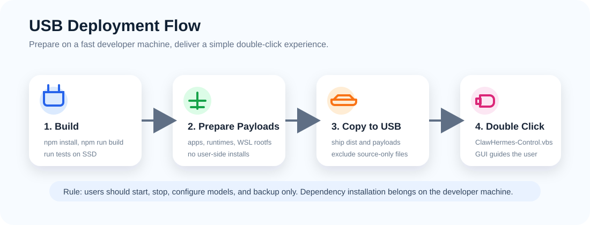

# U 盘部署与交付指南

本文说明如何把 ClawHermes-USB 做成普通用户可双击运行的 U 盘交付包，并回答两个关键问题：U 盘速度是否会拖慢运行、是否可以不把源码直接放到 U 盘。



如果你是交付人员，需要从 clone 下来的仓库生成一份可复制到 U 盘的目录，请优先阅读更细的 [U 盘交付包生成 Runbook](usb-release-build-runbook.zh-CN.md)。

## 结论

这些担心不是多虑，确实会存在。

- U 盘读写速度会影响体验，尤其是 WSL 文件系统、`node_modules`、SQLite、日志、缓存和大量小文件。
- 普通用户不应该在 U 盘上执行 `npm install`、`pnpm install`、`pip install` 或 `uv sync`。
- 可以不把源码直接放到 U 盘，但必须准备好可运行产物、上游应用 payload、运行时和许可证说明。
- 最稳妥的交付方式是在开发机或构建机上完成依赖安装、构建和 WSL rootfs 准备，然后把预构建结果复制到 U 盘。

## 推荐交付模式

### 开发仓库

开发者保留完整源码：

```text
core/node/src/
tests/
docs/
scripts/
package.json
package-lock.json
.git/
```

开发者在本地 SSD 上执行：

```powershell
npm install
npm run build
npm test
```

### 用户 U 盘

用户 U 盘只放运行需要的内容：

```text
launcher/
core/node/dist/
core/windows/
adapters/
config/
portal/
runtimes/
apps/
data/
README.zh-CN.md
docs/
```

其中 `apps/` 和 `runtimes/` 应该是已经准备好的 payload，而不是要求用户现场安装依赖的源码工作树。

## 关于 U 盘速度

U 盘速度会影响以下部分：

- WSL 导入目录 `data/wsl/<distribution-name>/`。
- 上游 Node 应用的 `node_modules`，因为里面有大量小文件。
- Python 虚拟环境、包缓存和模型缓存。
- SQLite 数据库、会话记录、日志、任务状态文件。
- OpenClaw 和 Hermes 首次启动时的配置读取、索引和缓存写入。

建议：

- 使用 USB 3.x 高速 U 盘或移动 SSD，不建议 USB 2.0 或廉价低速 U 盘。
- 依赖安装和构建都在开发机 SSD 上完成，再复制到 U 盘。
- 尽量减少 U 盘上的小文件写入，把日志和缓存做轮转。
- WSL rootfs、上游依赖和 Web UI 构建产物都提前准备好。
- 用户只做“启动、停止、模型配置、备份”，不要做构建和依赖安装。

## 关于不放源码

可以不把源码放到 U 盘，但要区分 ClawHermes 自己的代码和上游应用。

### ClawHermes 自己的代码

运行时主要需要：

```text
core/node/dist/
core/windows/
launcher/
adapters/
config/
portal/
```

交付给普通用户时，可以不放：

```text
core/node/src/
tests/
.git/
node_modules/
```

但如果未来 `core/node/dist/` 依赖第三方 npm 包，就要同时交付生产依赖或做 bundling。当前原则是：用户盘必须能离线运行，不能要求用户再安装依赖。

### 上游应用

建议交付预构建或预安装 payload：

- `apps/openclaw`：放已经能运行的 OpenClaw payload，或把 OpenClaw 和它的依赖预装进 WSL rootfs。
- `apps/hermes-agent`：放已经准备好的 Hermes Agent payload，Python 依赖建议预装进 WSL rootfs 或随运行时交付。
- `apps/hermes-web-ui`：放已经构建好的 Web UI 服务端和前端产物，避免用户现场 `npm install`。

如果上游项目许可证要求附带源码或许可证文本，需要按许可证保留相应 notice。不要为了“隐藏源码”违反上游许可证。

## WSL rootfs 交付

推荐流程：

1. 在开发机或构建机上准备 `ClawHermes-Ubuntu`。
2. 在 WSL 内安装 OpenClaw、Hermes Agent 需要的 Node、pnpm、Python、uv、依赖和配置。
3. 停止服务，清理临时缓存和无用日志。
4. 导出 rootfs：

```powershell
node core/node/dist/clawhermes.js wsl-export --distro Ubuntu --confirm-export --json
```

或按 `wsl-rootfs-guide` 生成 operator-managed rootfs：

```powershell
node core/node/dist/clawhermes.js wsl-rootfs-guide --distro Ubuntu --json
```

5. 把 rootfs 放到：

```text
runtimes/wsl/ubuntu-rootfs.tar
runtimes/wsl/ubuntu-rootfs.tar.sha256
```

6. 在干净 Windows 机器上测试导入：

```powershell
node core/node/dist/clawhermes.js wsl-import-plan --distro Ubuntu --json
node core/node/dist/clawhermes.js wsl-import --distro Ubuntu --confirm-import --json
```

注意：如果把 WSL 导入目录放在 U 盘上，便携性更好，但性能依赖 U 盘速度。性能优先时，可以考虑未来增加“导入到宿主机本地磁盘”的可选模式，但这会增加宿主机残留和卸载复杂度。

## 推荐打包步骤

在开发机上：

```powershell
npm install
npm run build
npm test
```

准备上游 payload：

```text
apps/openclaw
apps/hermes-agent
apps/hermes-web-ui
runtimes/windows
runtimes/wsl
```

### 使用 release 脚本生成交付目录

现在推荐使用项目内置脚本生成 U 盘交付目录，而不是手工复制整棵开发仓库：

```powershell
powershell -NoProfile -ExecutionPolicy Bypass `
  -File scripts/release/Build-UsbRelease.ps1 `
  -OutputRoot D:\release\ClawHermes-USB `
  -Clean
```

脚本会复制运行需要的目录：

```text
launcher/
core/windows/
core/node/dist/
adapters/
config/
portal/
runtimes/
apps/
docs/
```

同时会在交付目录中生成：

```text
启动 ClawHermes.vbs
START_HERE.txt
release-manifest.json
```

`release-manifest.json` 会记录来源目录、输出目录、payload 列表、裁剪规则和警告信息，方便交付前复核。

如果交付包需要支持 macOS Electrobun UI，最终 `DTC` 目录里应同时保留：

```text
ClawHermes-Control-Mac.app/
ClawHermes-Control-Mac.app.tar.gz
```

`.app` 在 macOS 上是目录，部分 ISO/USB 写入工具写到 FAT32 U 盘时可能会漏掉这个目录。`ClawHermes-Control-Mac.app.tar.gz` 是 fallback 文件；macOS 启动脚本发现 `.app` 缺失时会自动解压到 `data/tmp/macos-app/` 后再启动 UI。

默认情况下，脚本不会复制当前开发机的 `data/` 用户数据，只会创建空的 `data/logs`、`data/tmp`、`data/backups`、`data/settings` 和 `data/cache`。如果确实要把当前数据一起带走，可以显式加上：

```powershell
powershell -NoProfile -ExecutionPolicy Bypass `
  -File scripts/release/Build-UsbRelease.ps1 `
  -OutputRoot D:\release\ClawHermes-USB `
  -Clean `
  -IncludeData
```

### apps payload 裁剪策略

脚本会从 `apps/` 复制上游应用 payload，但会剥离明显不适合交付给普通用户的开发内容：

```text
.git/
.github/
.vscode/
docs/
test/
tests/
examples/
coverage/
src/
sources/
```

这能避免把上游 checkout 原样放到 U 盘上。需要注意的是，某些上游项目可能仍然把运行时文件放在类似 `packages`、`agent`、`gateway`、`plugins`、`skills` 这样的目录里。脚本不会盲目删除这些目录，而是把它们写入 `release-manifest.json` 的警告里，由交付人员判断是否需要进一步做独立 bundle、wheel、单文件产物或许可证处理。

### 手工复制的备选方式

如果 release 脚本不可用，也可以手工创建交付目录，例如：

```text
D:\release\ClawHermes-USB
```

复制运行所需目录，排除开发文件：

```powershell
robocopy . D:\release\ClawHermes-USB /MIR ^
  /XD .git node_modules tests core\node\src ^
  /XF *.tsbuildinfo
```

如果 `apps/` 中仍然是源码工作树，请改为复制预构建 payload，而不是直接把开发 checkout 原样放上 U 盘。

## 交付前检查清单

- `launcher/windows/ClawHermes-Control.vbs` 可以双击打开。
- GUI 点击“刷新状态”不会卡死或闪退。
- “安装向导”能说明缺少什么 payload。
- “模型配置”可以保存 API URL、模型名称和 API Key。
- `apps/openclaw`、`apps/hermes-agent`、`apps/hermes-web-ui` 已准备好。
- `runtimes/wsl/ubuntu-rootfs.tar` 和 `.sha256` 已准备好。
- 用户不需要运行 `npm install`、`pnpm install`、`pip install`。
- `data/logs/`、`data/tmp/`、`data/backups/` 可写。
- 在一台干净 Windows 机器上完成启动、停止、备份、重启测试。

## 给普通用户的最短说明

把 U 盘插入 Windows 电脑后：

1. 打开 U 盘里的 `ClawHermes-USB` 文件夹。
2. 双击 `launcher/windows/ClawHermes-Control.vbs`。
3. 第一次使用点“安装向导”。
4. 配好模型后点“启动服务”。
5. 点“打开界面”进入 OpenClaw 或 Hermes Web UI。
6. 结束使用前点“停止服务”。
